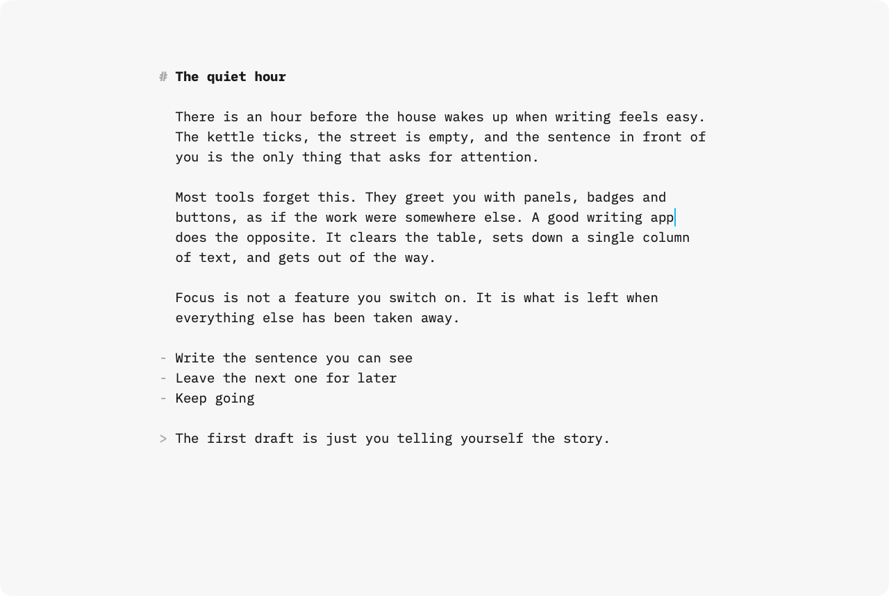
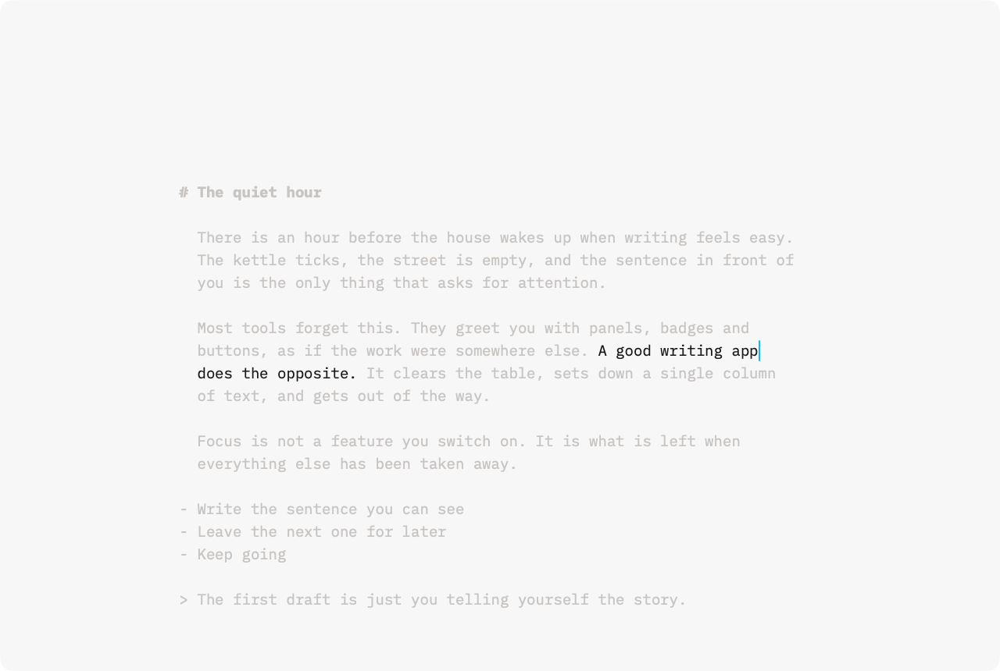
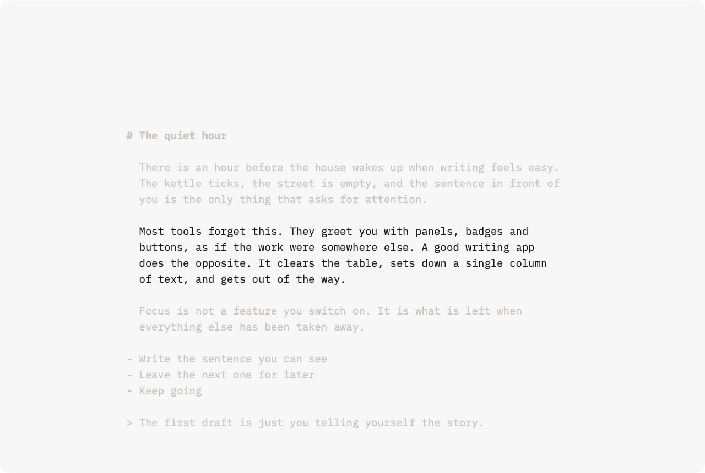
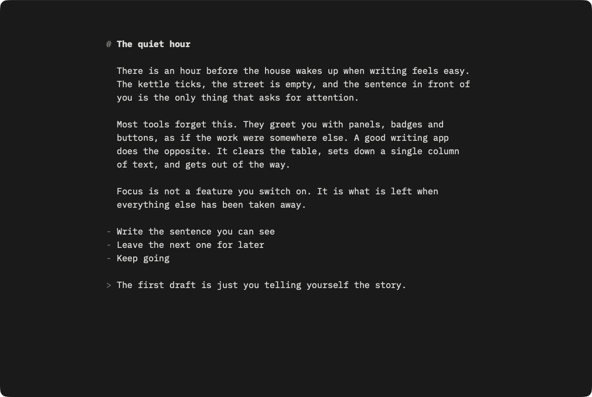
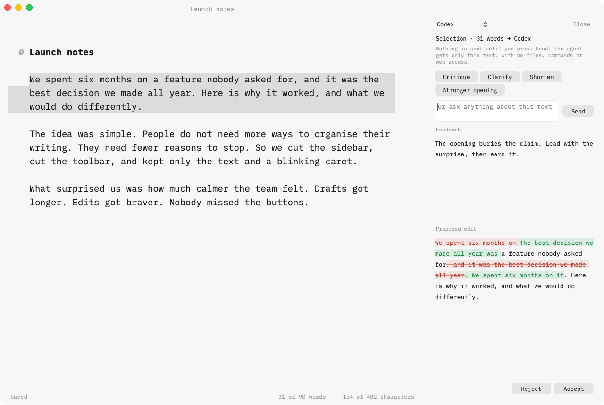

# Fluent Writer

A quiet macOS writing app built around focus: one column of prose, sentence and paragraph focus, typewriter scrolling, Markdown that stays out of the way, and drafts that are never lost.

## Screenshots



| Sentence focus | Paragraph focus |
| --- | --- |
|  |  |



Assist suggests an edit as a word diff. Your draft only changes if you press Accept.



## Build and run

Requires macOS 14+ and Xcode 16+ (Swift 6).

```sh
swift test                  # unit tests (WriterCore, WriterAgents)
script/build-app.sh         # builds "build/Fluent Writer.app"
open "build/Fluent Writer.app"
```

For the optional Claude assistant, install the bridge dependencies once before building the app:

```sh
(cd bridge/claude && npm install)
```

## Writing

| Action | Shortcut |
| --- | --- |
| Focus off / sentence / paragraph / typewriter | ⌃⌘0 / ⌃⌘1 / ⌃⌘2 / ⌃⌘3 |
| Toggle focus | ⌘D |
| Bigger / smaller text | ⌘+ / ⌘− |
| Copy for Twitter (clean plain text) | ⇧⌘C |
| Open recent | ⌘O |

Drafts live in `~/Documents/Fluent Writer` as plain Markdown. Saves are atomic, unsaved text is journaled for recovery, and the cursor position is restored on reopen.

## Assist (optional)

Assist (⌘J for Codex, ⇧⌘J for Claude, ⌥⌘J to toggle) sends only the selection, or the full draft when nothing is selected, and only when you press Send. Agents run in an empty scratch directory with read-only sandboxes and every tool request declined. Suggestions appear as a word diff; Accept applies them as one undoable edit, and editing the sent text first marks the suggestion out of date.

- Codex: install the `codex` CLI and run `codex login`.
- Claude: run `claude` once and sign in (the bundled SDK ships its own Claude Code binary).

`FLUENT_WRITER_AGENT_FIXTURE=/path/to/reply.txt` replays a canned reply instead of calling a provider, for offline UI testing.
